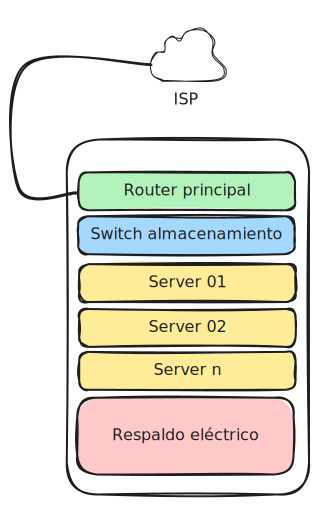

# Libre Data center

LibreDataCenter es un proyecto que tiene como objetivo documentar la creación de un pequeño centro de datos o un rack que pueda ser desplegado de manera sencilla utilizando piezas y equipos accesibles localmente en países de Latinoamérica. Este enfoque permite que los componentes necesarios, como servidores, sistemas de almacenamiento, fuentes de energía, y equipos de redes, se adquieran en tiendas de computación comunes, sin depender de proveedores internacionales o soluciones costosas y difíciles de obtener. La idea es que cualquier colectivo u organización pueda montar su propia infraestructura con herramientas y recursos que estén a su alcance, contribuyendo a la independencia tecnológica.

El proyecto está pensado para promover la autonomía tecnológica de organizaciones y colectivos, proporcionando una infraestructura que pueda ser auto-gestionada y operada sin necesidad de depender de terceros o de servicios en la nube de grandes corporaciones. LibreDataCenter busca ofrecer una alternativa accesible para quienes desean tener control total sobre su infraestructura de TI, utilizando un enfoque de código abierto y colaborativo, documentando cada paso y componente para que cualquier persona o grupo pueda replicar fácilmente este modelo.

